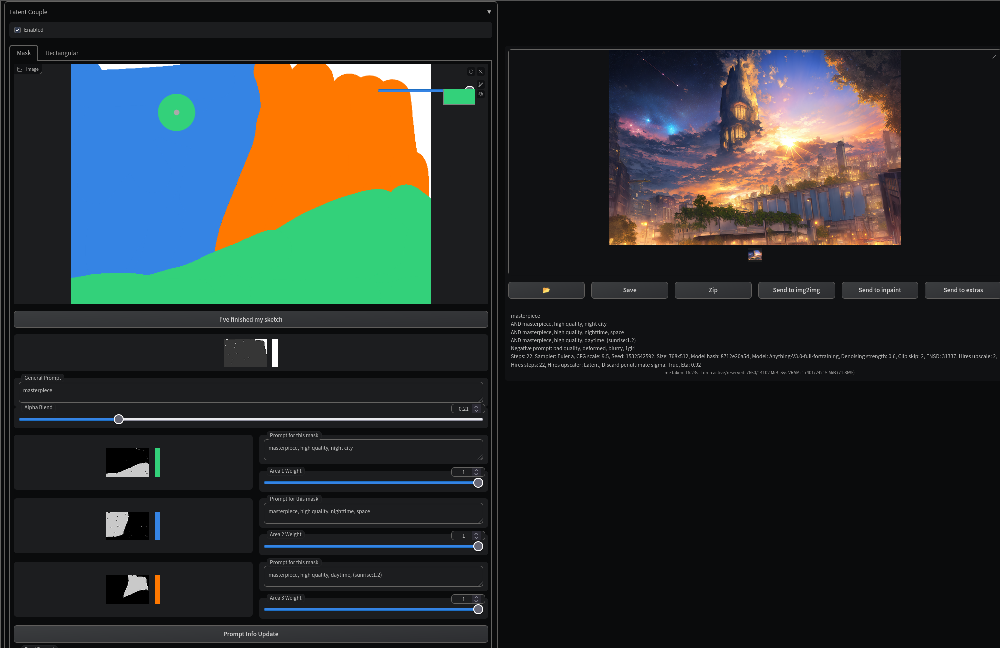

# Latent Couple extension

> ❗️ This package was originally forked from [ashen-sensored/stable-diffusion-webui-two-shot](https://github.com/ashen-sensored/stable-diffusion-webui-two-shot), and I am no longer actively maintaining it. Please consider reaching out to the original author or the community actively involved in the project. They would be better equipped to provide you with the most up-to-date information and support.

This extension is an extension of the built-in composable diffusion that allows you to determine the region of the latent space that reflects your subprompts.

## How to use


### Enabled
The effect of Latent Couple appears only when enabled is checked.

### Divisions, Positions, and Weights
Regions are created based on these parameters.

### End at this step
The processing of Latent Couple is performed until the specified step is reached.

### Visualize button and Regions
Press the Visualize button and you will get an image grid that visualizes the regions represented by the parameters.

### Extra generation params and Apply button
When you press the Send to button in PNG Info, the parameters of the saved Latent Couple are set to extra generation params.
Press the Apply button to actually apply the parameters.

## Examples

Parameters:
```
flower garden background
AND a man, short brown hair, black suit, red tie, modelshoot style
AND beautiful cute woman, long black hair, white wedding dress
```
Output:


## Old prerequisite
This extension need to apply cfg_denoised_callback-ea9bd9fc.patch
```
git apply --ignore-whitespace extensions/sd-webui-latent-couple/cfg_denoised_callback-ea9bd9fc.patch
```

## Prerequisite for prompt pasting
```
git apply --ignore-whitespace extensions/sd-webui-latent-couple/0001-Adding-after_ui_callback-for-scripts.patch
```

## Issues
- The extension's mask color sketching function does not work well with chrome(extreme stuttering) due to gradio's Image component bug, firefox is recommended.
- Drawing area with more than one stroke may lead to black edges in output mask, thus it is recommended to finish one color mask with one stroke. This is caused by brush edge blurring. Option Denoise Mask can be used to dampen this effect.


## Credits
- https://github.com/ashen-sensored/stable-diffusion-webui-two-shot
- two shot diffusion.ipynb https://colab.research.google.com/drive/1UdElpQfKFjY5luch9v_LlmSdH7AmeiDe?usp=sharing
